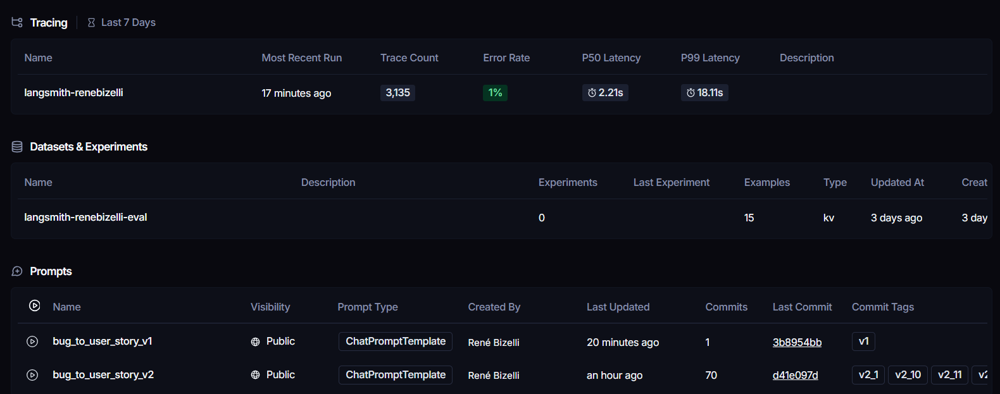
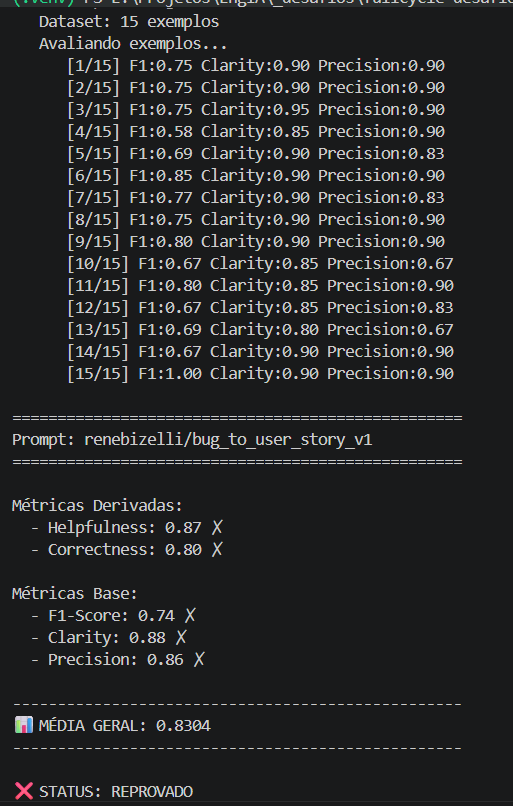
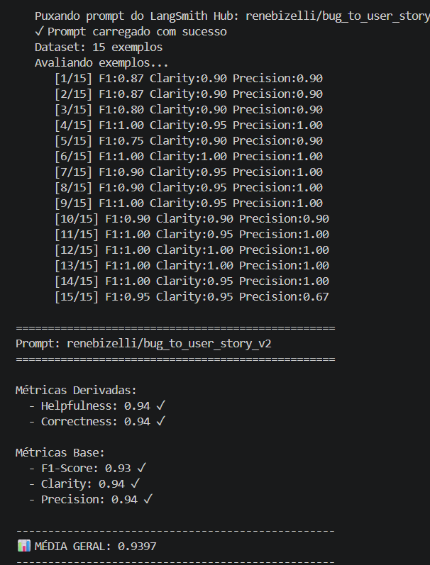

# Desafio 2 - Pull, Otimizacao e Avaliacao de Prompt

Este projeto implementa um fluxo de pull, otimizacao, publicacao e avaliacao de prompts usando LangSmith Prompt Hub, LangChain e provedores de LLM.

O caso de uso trabalhado e a conversao de relatos de bugs em user stories estruturadas para uma equipe de produto e desenvolvimento.

## Objetivo

Criar, otimizar e avaliar o prompt `bug_to_user_story_v2`, garantindo que ele gere uma saida clara, objetiva e aderente ao dataset de avaliacao a partir de um `bug_report`.

A saida esperada contem:

- User story no formato "Como um..., eu quero..., para que..."
- Criterios de aceitacao em BDD
- Secoes complementares quando justificadas pelo relato, como `Contexto Tecnico`, `Contexto de Seguranca`, `Criterios Tecnicos`, `Exemplo de Calculo`, `Contexto do Bug`, `Tasks Tecnicas Sugeridas` e `Metricas de Sucesso`

## Estrutura do Projeto

```text
.
|-- datasets/
|   `-- bug_to_user_story.jsonl
|-- docs/
|   `-- evidencias/
|       |-- home.png
|       |-- result-v1.png
|       `-- result-v2.png
|-- prompts/
|   `-- bug_to_user_story/
|       |-- bug_to_user_story_v1.yml
|       `-- bug_to_user_story_v2.yml
|-- src/
|   |-- evaluate.py
|   |-- metrics.py
|   |-- pull_prompts.py
|   |-- push_prompts.py
|   `-- utils.py
|-- tests/
|   `-- test_prompts.py
|-- requirements.txt
`-- README.md
```

## Técnicas Aplicadas (Fase 2)

| Tecnica escolhida                       | Justificativa                                                                                                                                                                  | Exemplo pratico de aplicacao                                                                                                                                                                                                              |
| --------------------------------------- | ------------------------------------------------------------------------------------------------------------------------------------------------------------------------------ | ----------------------------------------------------------------------------------------------------------------------------------------------------------------------------------------------------------------------------------------- |
| Role prompting                          | Define o comportamento esperado do modelo como Product Owner tecnico, reduzindo respostas genericas e aproximando a saida de uma user story utilizavel pelo time.              | O prompt inicia com a persona: "Voce e um Product Owner tecnico especializado em transformar relatos de bug em user stories acionaveis".                                                                                                  |
| Few-shot prompting sintetico            | Mantem a exigencia de exemplo de entrada/saida sem copiar exemplos literais do dataset, evitando overfitting direto nos casos de avaliacao.                                    | O prompt inclui um exemplo inventado de botao de salvar preferencias, apenas para demonstrar o formato da resposta.                                                                                                                       |
| Saida estruturada                       | O avaliador valoriza formato consistente. A estrutura reduz variacao desnecessaria e melhora clareza, F1 e precision.                                                          | A resposta sempre inicia com "Como um/uma..., eu quero..., para que..." e usa secoes como `Criterios de Aceitacao`, `Contexto Tecnico` e `Criterios Tecnicos` quando necessario.                                                          |
| Contratos por tipo de bug               | Alguns relatos exigem detalhes especificos, como endpoint, status HTTP, z-index, valores monetarios e regras de seguranca. Contratos ajudam o modelo a preservar esses sinais. | Foram criados contratos para UI simples, validacao de email, Safari, webhook de pagamento, relatorio de vendas, autorizacao, calculo com desconto, Android ANR, estoque, modal, checkout complexo, relatorios gerenciais e offline-first. |
| Preservacao de detalhes concretos       | A avaliacao compara a resposta com uma referencia e penaliza generalizacoes. Preservar termos do relato aumenta aderencia sem inventar informacoes.                            | O prompt instrui a manter termos como `POST /api/webhooks/payment`, `HTTP 500`, `HTTP 403`, `data_venda`, `"estoque limitado"`, `RecyclerView`, `ViewHolder pattern`, `DOMPurify`, `MRR` e `client_timestamp`.                            |
| Delimitacao de complexidade da resposta | Bugs simples nao devem receber secoes complexas; bugs complexos precisam de grupos, contexto e tasks. Essa proporcionalidade melhora precision.                                | Para bugs simples, usar somente user story e criterios. Para checkout complexo, usar secoes com `=== USER STORY PRINCIPAL ===`, `=== CRITERIOS TECNICOS ===`, `=== CONTEXTO DO BUG ===` e `=== TASKS TECNICAS SUGERIDAS ===`.             |
| Restricao contra alucinacao             | Evita que o modelo adicione requisitos, tecnologias ou campos que nao aparecem no relato ou que nao sao naturais para o fluxo.                                                 | O prompt orienta a nao adicionar `complexidade`, `desenvolvedor indicado`, notas, introducoes ou secoes tecnicas em casos simples.                                                                                                        |

## Resultados Finais

### Link do LangSmith

Dataset:

https://smith.langchain.com/public/ad3b54d0-1daa-40c7-ac78-9189897eba44/d

Prompt avaliado:

`renebizelli/bug_to_user_story_v2`

Versao final publicada:

`v2_69`

Dataset de avaliacao:

`langsmith-renebizelli-eval` com 15 exemplos.

### Screenshots das avaliações

As screenshots dos resultados foram salvas em `docs/evidencias/`:

- Tela de traces do LangSmith: [`docs/evidencias/home.png`](docs/evidencias/home.png)
- Resultado do prompt v1: [`docs/evidencias/result-v1.png`](docs/evidencias/result-v1.png)
- Resultado do prompt v2: [`docs/evidencias/result-v2.png`](docs/evidencias/result-v2.png)

Tela de traces:



Resultado v1:



Resultado v2:



### Resultado obtido com v2

A avaliacao completa foi executada com o `src/evaluate.py` original, sem alteracao em `src/metrics.py`.

| Metrica     | Score v2_69 | Status   |
| ----------- | ----------: | -------- |
| Helpfulness |        0.92 | Aprovado |
| Correctness |        0.93 | Aprovado |
| F1-Score    |        0.94 | Aprovado |
| Clarity     |        0.93 | Aprovado |
| Precision   |        0.92 | Aprovado |
| Media geral |      0.9268 | Aprovado |

Status final: aprovado, com todas as metricas acima de `0.9`.

### Tabela comparativa: v1 vs v2

| Prompt                 | Descricao                                                                                         | Helpfulness | Correctness | F1-Score | Clarity | Precision | Media geral | Status    |
| ---------------------- | ------------------------------------------------------------------------------------------------- | ----------: | ----------: | -------: | ------: | --------: | ----------: | --------- |
| `bug_to_user_story_v1` | Prompt inicial simples, sem contratos por tipo de bug e com pouca orientacao de formato.          |      0.8763 |      0.8118 |   0.7544 |  0.8833 |    0.8693 |      0.8390 | Reprovado |
| `bug_to_user_story_v2` | Prompt otimizado com persona, exemplo sintetico, formato estruturado e contratos por tipo de bug. |        0.92 |        0.93 |     0.94 |    0.93 |      0.92 |      0.9268 | Aprovado  |

## Evidências no LangSmith

As evidencias da avaliacao estao documentadas no dashboard do LangSmith e nas screenshots anexadas ao repositorio.

Link do dashboard:

https://smith.langchain.com/projects/renebizelli

- Dataset de avaliacao `langsmith-renebizelli-eval` com 15 exemplos.
- Execucoes do prompt `renebizelli/bug_to_user_story_v2`, versao `v2_69`, com notas >= 0.9.
- Screenshot da tela de traces em [`docs/evidencias/home.png`](docs/evidencias/home.png).
- Exemplos de 3 traces:
  - https://smith.langchain.com/public/e5b7ee6e-be97-406c-ac87-94da7dba40e2/r
  - https://smith.langchain.com/public/67196777-31ef-47e4-80a2-02d52ef52990/r
  - https://smith.langchain.com/public/904498aa-1069-4fd4-80c6-28ae28c00130/r

## Como Executar

### Pré-requisitos

- Python 3.12 ou compativel com as dependencias do projeto
- Conta e API key da OpenAI ou Google Gemini
- Conta e API key do LangSmith
- Acesso ao LangSmith Prompt Hub

### Dependências

Instale as dependencias:

```bash
pip install -r requirements.txt
```

### Configuracao do ambiente

Crie um arquivo `.env` na raiz do projeto.

Exemplo usando OpenAI:

```env
LLM_PROVIDER=openai
LLM_MODEL=gpt-4o-mini
EVAL_MODEL=gpt-4o
OPENAI_API_KEY=sua_chave
LANGSMITH_API_KEY=sua_chave
LANGSMITH_ENDPOINT=https://api.smith.langchain.com
LANGSMITH_PROJECT=prompt-optimization-challenge-resolved
USERNAME_LANGSMITH_HUB=seu_usuario
```

Exemplo usando Google Gemini:

```env
LLM_PROVIDER=google
LLM_MODEL=gemini-2.5-flash
EVAL_MODEL=gemini-2.5-flash
GOOGLE_API_KEY=sua_chave
LANGSMITH_API_KEY=sua_chave
LANGSMITH_ENDPOINT=https://api.smith.langchain.com
LANGSMITH_PROJECT=prompt-optimization-challenge-resolved
USERNAME_LANGSMITH_HUB=seu_usuario
```

### Fase 1: Pull do prompt inicial

Baixe o prompt v1 do LangSmith Prompt Hub:

```bash
python src/pull_prompts.py
```

Tambem e possivel informar um prompt especifico:

```bash
python src/pull_prompts.py owner/nome_do_prompt
```

### Fase 2: Otimizacao do prompt

Edite o arquivo do prompt otimizado:

```text
prompts/bug_to_user_story/bug_to_user_story_v2.yml
```

O prompt final deste projeto esta publicado como `v2_69`.

### Fase 3: Validacao local do prompt

Rode os testes automatizados:

```bash
pytest
```

Resultado esperado:

```text
6 passed
```

### Fase 4: Push do prompt otimizado

Publique o prompt v2 no LangSmith Prompt Hub:

```bash
python src/push_prompts.py
```

### Fase 5: Avaliacao completa

Execute a avaliacao contra os 15 exemplos do dataset:

```bash
python src/evaluate.py
```

O script executa as etapas abaixo:

1. Carrega `datasets/bug_to_user_story.jsonl`.
2. Cria ou reutiliza o dataset `langsmith-renebizelli-eval`.
3. Faz pull do prompt publicado no LangSmith Hub.
4. Executa o prompt contra todos os exemplos.
5. Calcula `Helpfulness`, `Correctness`, `F1-Score`, `Clarity` e `Precision`.
6. Exibe o resumo final com status de aprovado ou reprovado.

### Criterio de aprovacao

Todas as metricas precisam ser maiores ou iguais a `0.9`:

```text
Helpfulness >= 0.9
Correctness >= 0.9
F1-Score >= 0.9
Clarity >= 0.9
Precision >= 0.9
Media geral >= 0.9
```

## Metricas Utilizadas

- `F1-Score`: mede aderencia entre resposta gerada e referencia.
- `Clarity`: avalia organizacao, clareza, concisao e ausencia de ambiguidade.
- `Precision`: avalia foco, correcao factual e ausencia de informacoes inventadas.
- `Helpfulness`: media derivada entre `Clarity` e `Precision`.
- `Correctness`: media derivada entre `F1-Score` e `Precision`.
